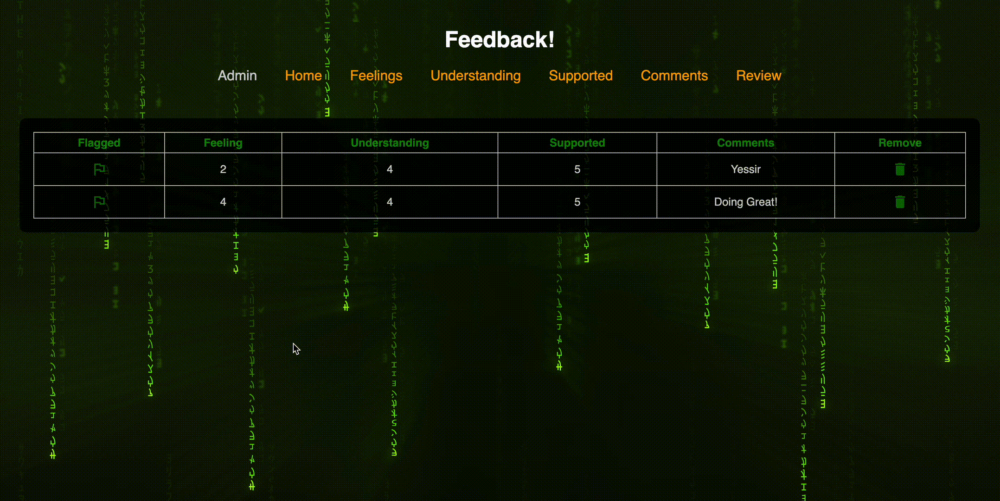

# React Feedback Loop

## Heroku Link

[Redux Feedback Loop](https://redux-feedback-loop-1.herokuapp.com/#/)

## Description

This is a feedback management application following similar guidelines to Prime Academy. You follow the prompts with your daily feedback and can do this as many times as you'd like. There is an admin page where you can manage the previous feedback stored in the database.

## Interface

## Languages

JavaScript, CSS, HTML, Postgresql, and Markdown demonstrated.

## Packages

This is built using React, Redux, Material UI, Node.js with Express, Pg, Nodemon, Axios, SweetAlert2, and DotEnv utilized.

## Future Updates

Future updates are unknown at this time.